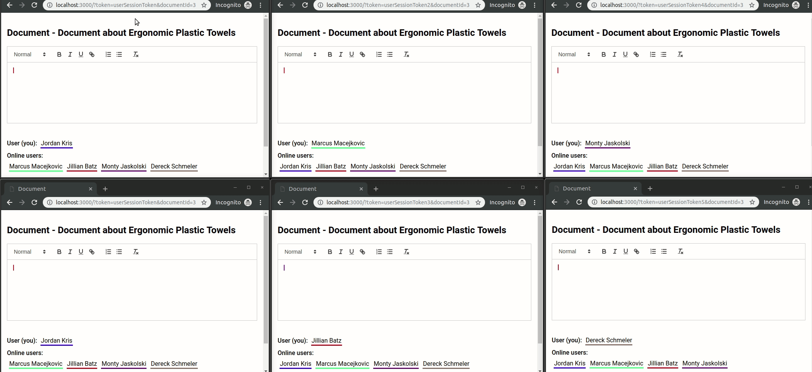

# Collaborative Rich Text Editor

Collaborative rich text editor based on Quill (with quill-cursors module) and ShareDB  



Inspired by https://github.com/pedrosanta/quill-sharedb-cursors

## Application configuration:
```
cd collaborative-rich-text-editor
cp config/example.env .env
vi .env
``` 
To see verbose log set NODE_ENV=development  

## NPM scripts:
- clean - remove build folder
- dev:server - build and watch development server
- dev:ui - build and watch development ui
- dev:start - run and watch development server (have to be built before)
- dev - build, run and watch development server and ui

- prod:server - build production server
- prod:ui - build production ui
- prod - build production

- lint - run tslint and eslint
- lint:fix - run tslint and eslint with fix option
- test - run unit tests

# How to use
http://localhost:3000?token=sessionToken&documentId=id  
sessionToken - unique user token (any string)  
documentId - unique document identifier (any integer)  

## Webstorm:
TypeScript config file:  
Preferences -> Languages & Frameworks -> TypeScript -> Options:  
-p ./config/common.tsconfig.json  


# How to use with MongoDB

Uncomment code in files: src/server/config.ts and src/server/sharedb/index.ts  

To change a MongoDB connection string set MONGODB_URI in .env file  
